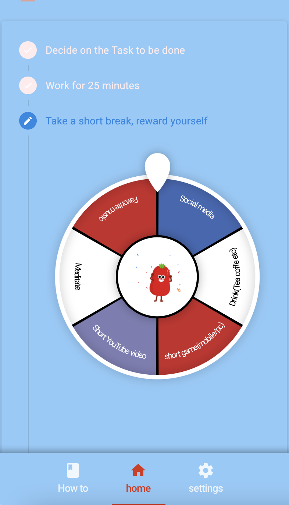

# Tomatodo


Pomodoro task application that rewards user with luck wheel

   [DEMO](https://emingenc.github.io/tomatodo)

<a href='https://emingenc.github.io/pomodoro_wheel' target="_blank" align="center">
  
  
  
  
  
</a>

## Install the dependencies
```bash
yarn
```

### Start the app in development mode (hot-code reloading, error reporting, etc.)
```bash
quasar dev
```

### Lint the files
```bash
yarn run lint
```

### Build the app for production
```bash
quasar build
```

### Customize the configuration
See [Configuring quasar.conf.js](https://v2.quasar.dev/quasar-cli/quasar-conf-js).
